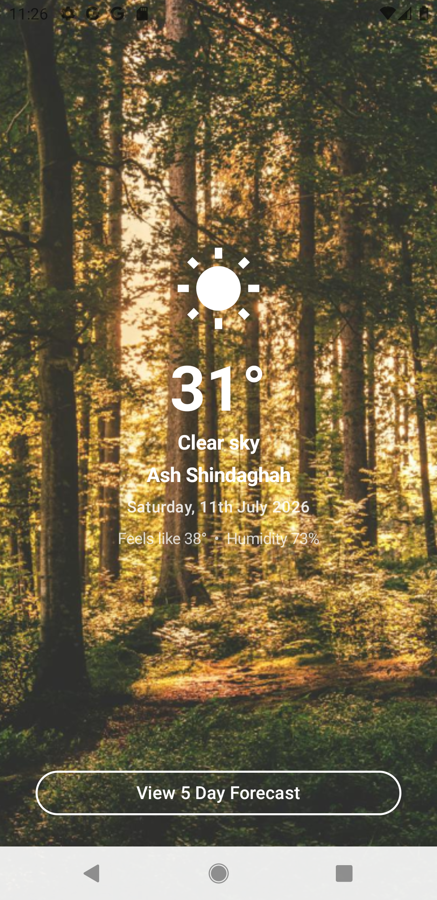
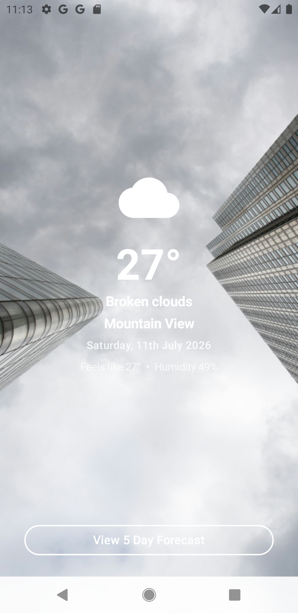
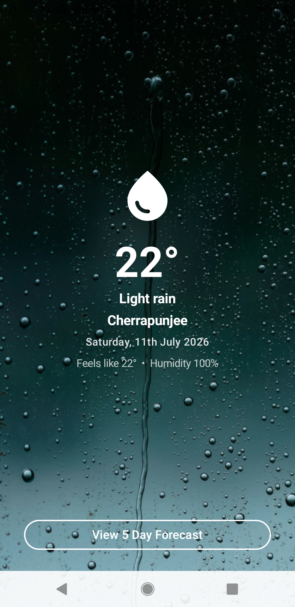
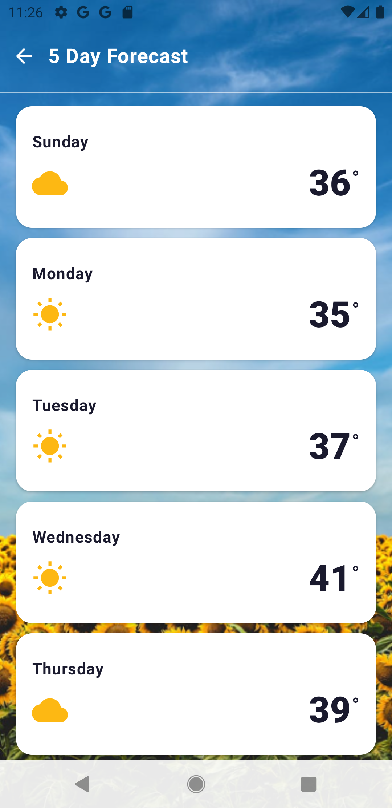
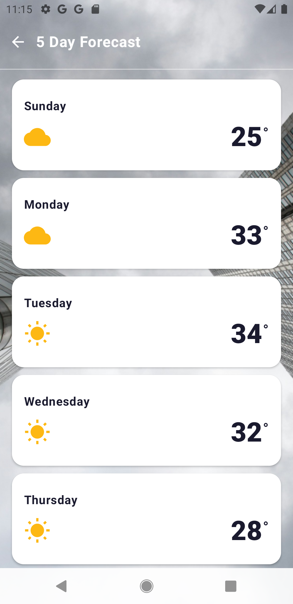
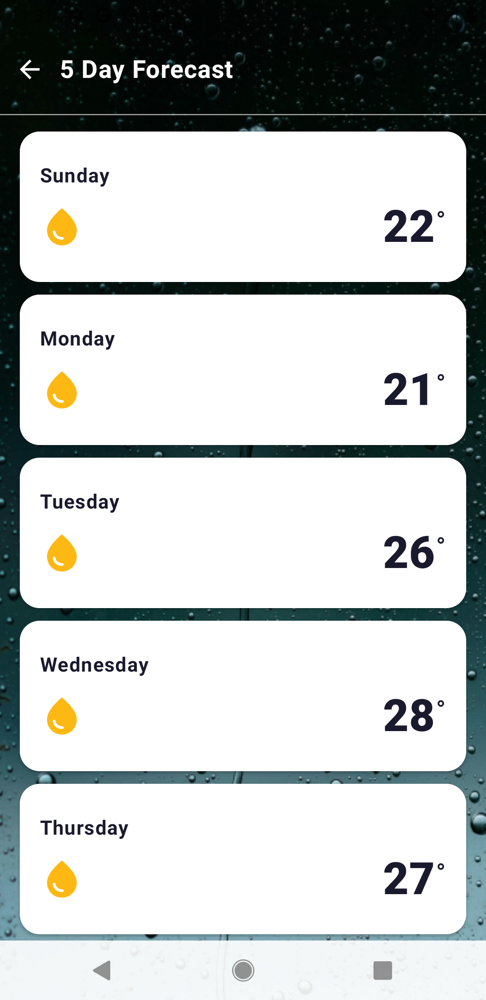
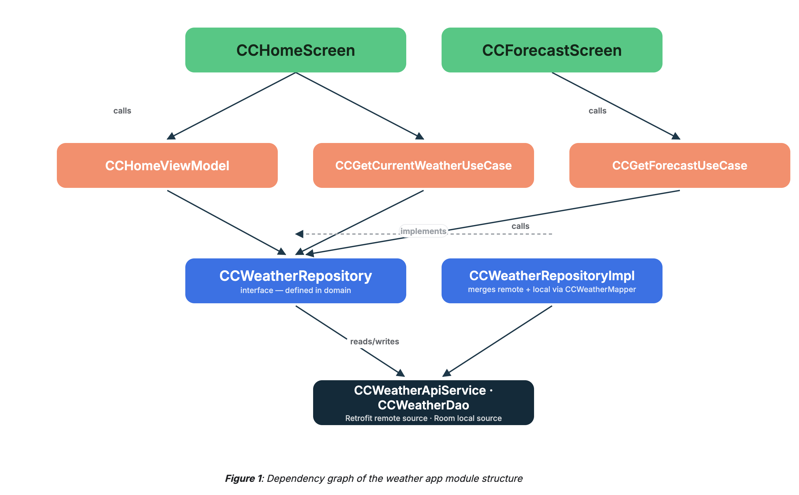
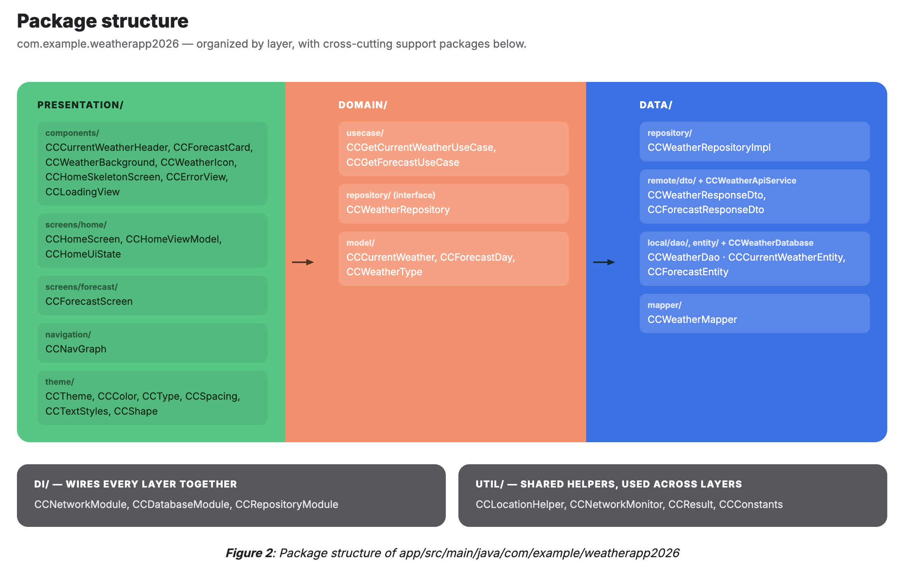
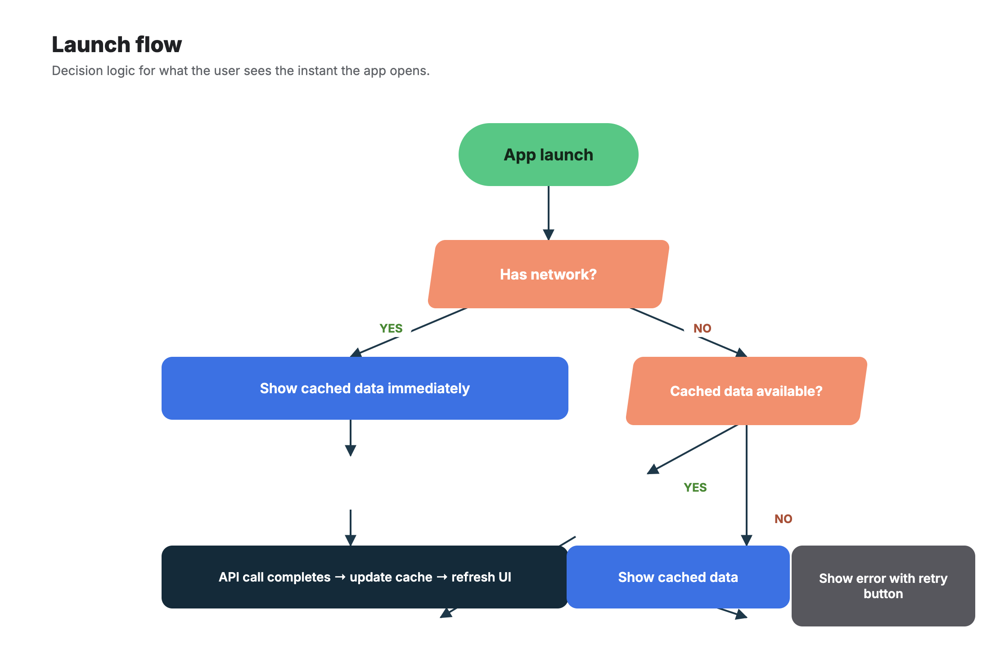

# DVT Weather App

An Android weather application built as a DVT technical assessment. The app fetches real-time weather and a 5-day forecast using the OpenWeatherMap API, works offline via a local Room cache, and adapts its UI to the current weather condition.

---

## Screenshots

### Home Screen
| Sunny | Cloudy | Rainy |
|---|---|---|
|  |  |  |

### 5 Day Forecast Screen
| Sunny | Cloudy | Rainy |
|---|---|---|
|  |  |  |

> The background image, icon and colour theme all change automatically based on the current weather condition — Sunny uses a forest scene, Cloudy an overcast sky, Rainy a rain-on-glass scene.

---

## Architecture

The app follows **Clean Architecture** with an **MVVM** presentation layer. Dependency flow is strictly one-directional — outer layers depend on inner layers, never the reverse.



### Data flow

1. `CCHomeViewModel` calls the two use cases with the device's GPS coordinates.
2. Each use case delegates to `CCWeatherRepository`.
3. `CCWeatherRepositoryImpl` emits `CCResult.Loading`, then:
   - **Online** — calls the API, maps the response, upserts Room, emits fresh data.
   - **Offline** — serves whatever is cached in Room; emits `CCResult.Error` if the cache is also empty.
4. The ViewModel maps `CCResult` → `CCHomeUiState` (Loading / Success / Error) exposed as a `StateFlow`.
5. Compose screens collect the state and recompose reactively.

---

## Layers in detail

### Domain

| File | Purpose |
|---|---|
| `CCWeatherRepository` | Interface defining the contract — isolated from Android, network and DB concerns |
| `CCGetCurrentWeatherUseCase` | Single-responsibility: fetch current weather for a coordinate pair |
| `CCGetForecastUseCase` | Single-responsibility: fetch 5-day forecast for a coordinate pair |
| `CCCurrentWeather` | Pure Kotlin model for current conditions |
| `CCForecastDay` | Pure Kotlin model for a single forecast day |
| `CCWeatherType` | Enum — `SUNNY`, `CLOUDY`, `RAINY` — derived from OpenWeatherMap condition IDs |

### Data

| File | Purpose |
|---|---|
| `CCWeatherRepositoryImpl` | Orchestrates remote + local sources; implements offline-first strategy |
| `CCWeatherApiService` | Retrofit interface for OWM `/weather` and `/forecast` endpoints |
| `CCWeatherMapper` | Converts DTOs → Room entities → domain models; groups forecast items by date and picks daily min/max |
| `CCWeatherDao` | Room DAO: `upsertCurrentWeather`, `upsertForecast`, `clearForecast` |
| `CCWeatherDatabase` | Room database definition |
| `CCNetworkMonitor` | Wraps `ConnectivityManager` to check live network availability |

### Presentation

| File | Purpose |
|---|---|
| `CCHomeViewModel` | Handles location permission flow, resolves GPS (5 s timeout → default coords), loads weather |
| `CCHomeUiState` | Sealed class: `Loading`, `Success(weather, forecast, weatherType)`, `Error(message)` |
| `CCHomeScreen` | Full-screen current weather with a **View 5 Day Forecast** navigation button |
| `CCForecastScreen` | Full-screen 5-card forecast with a back button; cards enter with staggered fade-in animation |
| `CCNavGraph` | Two-destination Compose Navigation graph; forecast shares the HOME ViewModel instance |
| `CCWeatherBackground` | Swaps background images per weather type (`bg_forest`, `bg_sunny`, `bg_cloudy`, `bg_rainy`) |
| `CCCurrentWeatherHeader` | Icon · temperature · description · city · today's date · feels-like / humidity |
| `CCForecastCard` | White rounded card — day name at top, weather icon + temperature on the row below |
| `CCHomeSkeletonScreen` | Shimmer skeleton shown during the Loading state — matches the home layout shape |
| `CCErrorView` | Full-screen error with retry button |

### Design System — Token Layer

| File | What it defines |
|---|---|
| `CCColor.kt` | Raw palette + `CCColors` data class with semantic roles (`onWeatherSurface`, `forecastIcon`, `onForecastCard` …) |
| `CCSpacing.kt` | `CCSpacing` — raw scale (`xs` 4dp → `xxl` 32dp) plus semantic aliases (`cardEdge`, `screenEdge`, `iconHeader`, `iconCard`) |
| `CCTextStyles.kt` | `CCTextStyles` — 10 named `TextStyle`s built from color tokens (`temperatureDisplay`, `cardDayName`, `bodyDetail` …) |
| `CCShape.kt` | `CCShapes` (forecast card corner radius) and `CCElevation` (card depth, divider thickness, button border width) |
| `CCTheme.kt` | `CCWeatherTheme` — provides all tokens via `CompositionLocalProvider`; `CCTheme` object exposes them as `@ReadOnlyComposable` getters |

Every component accesses design values through `CCTheme.colors.*`, `CCTheme.spacing.*`, `CCTheme.textStyles.*`, `CCTheme.shapes.*`, and `CCTheme.elevation.*` — no hardcoded `Color`, `dp`, or `sp` literals in any composable.

### Dependency Injection (Hilt)

| Module | Provides |
|---|---|
| `CCNetworkModule` | `OkHttpClient`, `Retrofit`, `CCWeatherApiService` |
| `CCDatabaseModule` | `CCWeatherDatabase`, `CCWeatherDao` |
| `CCRepositoryModule` | Binds `CCWeatherRepositoryImpl` → `CCWeatherRepository` interface |

---

## Tech Stack

| Category | Library / Tool |
|---|---|
| Language | Kotlin |
| UI | Jetpack Compose + Material 3 |
| Navigation | Compose Navigation |
| State management | AndroidX ViewModel + StateFlow |
| Dependency injection | Hilt |
| Networking | Retrofit 2 + OkHttp + Gson |
| Local persistence | Room |
| Location | FusedLocationProviderClient (Play Services) |
| Logging | Timber |
| Min SDK | 24 (Android 7.0) |
| Target SDK | 36 |

---

## Design System

The presentation layer uses a **token-based design system** built entirely with Compose's `CompositionLocal` API — the same pattern used by Material Theme internally.

### Three-layer structure

```
Raw values          →     Semantic tokens      →     Components
────────────────────────────────────────────────────────────────
Color(0xFFFFFFFF)   →  onWeatherSurface        →   Text(style = ...)
16.dp               →  spacing.cardEdge        →   padding(CCTheme.spacing.cardEdge)
56.sp Bold          →  textStyles.temperature  →   style = CCTheme.textStyles.temperatureDisplay
```

**Raw values** live in `CCColor.kt` and `CCSpacing.kt` as named constants.
**Semantic tokens** are data classes (`CCColors`, `CCSpacing`, `CCTextStyles`, `CCShapes`, `CCElevation`) that give values a *meaning* independent of their raw numbers.
**Components** read tokens through the `CCTheme` object — swapping a token value propagates the change everywhere it is used.

### Accessing tokens

```kotlin
// Color
Text(color = CCTheme.colors.onWeatherSurface)

// Spacing
Modifier.padding(horizontal = CCTheme.spacing.screenEdge)

// Typography
Text(style = CCTheme.textStyles.temperatureDisplay)

// Shape
Card(shape = CCTheme.shapes.forecastCard)

// Elevation / border
CardDefaults.cardElevation(defaultElevation = CCTheme.elevation.forecastCard)
BorderStroke(CCTheme.elevation.buttonBorderWidth, CCTheme.colors.onWeatherSurface)
```

### Why this matters

- Changing a spacing value in one place updates every component that uses that token
- Text styles embed colour, size, and weight together so a `Text` composable only needs `style =`
- Adding dark-mode or brand-switch support only requires providing a different `CCColors` instance to `CompositionLocalProvider`

---

## Animations

### Loading skeleton

While the first data fetch is in progress, the app shows `CCHomeSkeletonScreen` — a layout that mirrors the home screen's structure (circular icon placeholder, temperature bar, description bar, city bar, date bar, button bar). Each box pulses between 20% and 55% white opacity using `InfiniteTransition`.

### Staggered forecast cards

When the forecast screen enters, each of the five cards fades in sequentially using `Animatable` + `LaunchedEffect`. Card N waits `N × 80 ms` before animating to full opacity over 300 ms. The layout is reserved at full size from the start so there is no height jump — only the alpha changes.

---

## LeakCanary — Memory Leak Detection

[LeakCanary](https://square.github.io/leakcanary/) is included as a `debugImplementation` dependency. It runs automatically in debug builds — no code changes required.

**How it works:**
- Watches every Activity, Fragment, and ViewModel for leaks after they are destroyed
- When a leak is detected it takes a heap dump, analyses the retain path, and posts a notification with a full leak trace
- Only active in debug builds; the release APK is completely unaffected

**To trigger a check manually:** navigate around the app and press back to destroy screens — LeakCanary will analyse automatically and notify you in the status bar if a leak is found.

---

## Static Code Analysis — Detekt

[Detekt](https://detekt.dev) is configured at the root project level (`detekt.yml`) and analyses all Kotlin source files for:

| Category | Examples caught |
|---|---|
| **Complexity** | Methods that are too long, too many parameters, cyclomatic complexity |
| **Style** | Line length > 140 chars, wildcard imports |
| **Potential bugs** | Unreachable code, `equals()` always returning true/false |
| **Performance** | Boxed primitives used where array primitives would suffice |
| **Exceptions** | Swallowed exceptions, catching `Exception` too broadly |

**Run analysis:**
```bash
./gradlew detekt
```

Report is saved to:
```
app/build/reports/detekt/detekt.html
```

Open that file in a browser to see all findings with file, line number, and explanation.

> **Note:** Android Studio's built-in **Profiler** (CPU, Memory, Network tabs) is a separate tool for *runtime* performance analysis — measuring frame rates, detecting jank, and profiling heap allocations while the app is running. Detekt and Profiler complement each other: Detekt catches issues before the app runs; Profiler diagnoses issues at runtime.

---

## Unit Tests

**17 / 17 passing** — run with `./gradlew :app:testDebugUnitTest`

| Test class | Tests | Coverage |
|---|---|---|
| `CCHomeViewModelTest` | 4 | Initial Loading state · permission granted → Success · permission denied → default-location fallback · API error → Error state |
| `CCWeatherRepositoryImplTest` | 4 | Cache-then-fresh emission · no cache + offline → Error · online fetch clears and reinserts DB · offline-only cache serving |
| `CCGetCurrentWeatherUseCaseTest` | 2 | Delegates to repository with exact coordinates · propagates errors downstream |
| `CCGetForecastUseCaseTest` | 2 | Delegates to repository · handles empty-list response |
| `CCWeatherMapperTest` | 5 | DTO→Entity field mapping · Entity→Model field mapping · forecast grouping by date · daily min/max calculation · weather-type derivation from condition ID |

**Test libraries:** JUnit 4 · MockK · Turbine (Flow assertions) · kotlinx-coroutines-test

---

## Running the Project (Reviewer Guide)

### Prerequisites

| Tool | Version |
|---|---|
| Android Studio | Hedgehog 2023.1.1 or newer |
| JDK | 17 |
| Android SDK | API 36 (Target) / API 24 (Min) |
| Device or Emulator | API 24+ |

---

### Step 1 — Clone the repository

```bash
git clone <repo-url>
cd WeatherApp2026
```

---

### Step 2 — Add the API key

The OpenWeatherMap API key is not committed to source control. Create a `local.properties` file in the **project root** (same level as `settings.gradle.kts`) and add:

```properties
WEATHER_API_KEY=2bd2f70407098d25036c57fba8268d00
```

> The key is read at build time via `buildConfigField` in `app/build.gradle.kts` and is never exposed in source code.

---

### Step 3 — Open in Android Studio

1. Open Android Studio
2. Select **File → Open** and choose the `WeatherApp2026` folder
3. Wait for Gradle sync to complete (first sync downloads dependencies — may take a few minutes)

---

### Step 4 — Run the app

**On a physical device:**
1. Enable **Developer Options** and **USB Debugging** on the device
2. Connect via USB
3. Select the device from the toolbar and press ▶ **Run**

**On an emulator:**
1. Open **Device Manager** in Android Studio and create or start an emulator (API 24+)
2. Press ▶ **Run**

> The emulator may not have a GPS fix — the app automatically falls back to **Johannesburg** after a 5-second timeout so it will always load data.

**Via command line:**
```bash
# Install and launch on a connected device/emulator
./gradlew :app:installDebug
adb shell am start -n com.example.weatherapp2026/.MainActivity
```

---

### Step 5 — Grant location permission

On first launch the app requests location permission. Grant it to see weather for your current location, or deny it to see the Johannesburg default.

---

### Step 6 — Run unit tests

```bash
./gradlew :app:testDebugUnitTest
```

Results are saved to:
```
app/build/reports/tests/testDebugUnitTest/index.html
```
Open that file in a browser for a full test report.

---

### Step 7 — Run static analysis

```bash
./gradlew detekt
```

Exits with **BUILD SUCCESSFUL** and 0 issues. The full HTML report is at:
```
app/build/reports/detekt/detekt.html
```

---

### Step 8 — Browse Compose previews (optional)

Open any of the following files in Android Studio and switch to the **Split** or **Design** tab to see all UI previews without running the app:

- `CCHomeScreen.kt` — Home screen in Sunny / Cloudy / Rainy
- `CCForecastScreen.kt` — Forecast screen in Sunny / Cloudy / Rainy
- `CCForecastCard.kt` — Individual forecast card
- `CCCurrentWeatherHeader.kt` — Weather header component
- `CCWeatherIcon.kt` — All 7 weather icon variants
- `CCHomeSkeletonScreen.kt` — Loading skeleton preview
- `CCWeatherBackground.kt` — All four background variants

---

## Project Structure



---

## Offline Behaviour



---

*Built with Kotlin · Jetpack Compose · Clean Architecture · MVVM*
